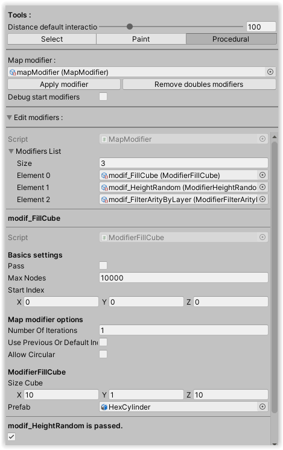

# __Custom Procedural Modifiers__



Like you see in the tutorial [Editor](./3.Editor.md), the system is based on modifiers that are sequentially applied.
If you see the code it reposed on three functions for implementing a custom **Modifier**.

Here a example of construction for custom modifier.
```C#
using MapTileGridCreator.Core;

using UnityEngine;

namespace MapTileGridCreator.TransformationsBank
{
	using SizeGrid = UnityEngine.Vector3Int;

	[CreateAssetMenu(fileName = "modif_Custom", menuName = "MapTileGridCreator/Modifiers/Custom")]
	public class ModifierFillCube : Modifier
	{
		#region Inspector
#pragma warning disable 0649

		[Header("ModifierCustom")]

        //Options ...

#pragma warning restore 0649
		#endregion

        protected override void BeforeModify(Grid3D grid, Vector3Int index)
		{
			//Some pre-treatment on options
		}

		protected override void AfterModify()
		{
			//Some after-treatment
		}

		public override Queue<Vector3Int> Modify(Grid3D grid, Vector3Int index)
		{
			//Modifications

            //Give the next indexes in to the queue iteration.
			return nextIndexes; // can be null
		}
	}
}

```

The main function **Modify** permit to do some modification to the current index cell that you have given with precedent operations. The first iteration is always the start index, or the index from previous operator if the option is checked.

Then the grid will be iterate via a **Breadth First Search** algorithm, without repetition of indexes (exception of allow circular). It will continue until the max nodes limit have been reached, or if there is any index cells remaining for iteration.

It's up to the programmer to choose the strategy for giving the next indexes and the modifications he do in **Modify**.
Watchout of large grid modifiers that can badly impact the editor. Because of freeze or crash from Unity, i advice to restrict the number of maxnodes to 10 000 ~ with a good configuration.